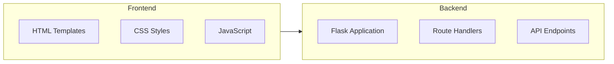
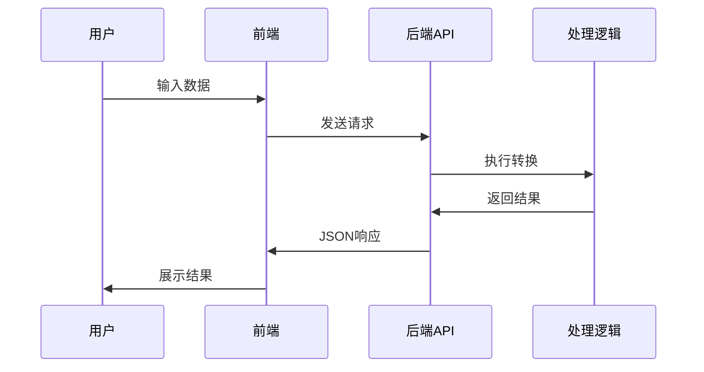

## 1. 架构设计



## 2. 技术栈说明
- 前端: HTML5 + CSS3 + JavaScript
- 后端: Flask@3.0 (Python Web框架)
- 模板引擎: Jinja2
- 依赖管理: 手动创建requirements.txt

## 3. 路由定义

### 3.1 页面路由
| 路由 | 方法 | 描述 |
|------|------|------|
| / | GET | 工具箱首页 |
| /tools/time | GET | 时间工具页面 |
| /tools/encode | GET | 编码转换工具页面 |
| /tools/url | GET | URL工具页面 |

### 3.2 API接口
| API路由 | 方法 | 描述 |
|---------|------|------|
| /api/timestamp | POST | 时间戳转日期时间 |
| /api/datetime | POST | 日期时间转时间戳 |
| /api/encode | POST | 编码转换 |
| /api/decode | POST | 解码转换 |
| /api/url/encode | POST | URL编码 |
| /api/url/decode | POST | URL解码 |
| /api/url/parse | POST | URL参数解析 |

## 4. 项目结构
```
/workspace/
├── app.py                 # Flask应用主文件
├── requirements.txt       # Python依赖
├── README.md             # 项目说明
├── static/               # 静态资源
│   ├── css/
│   │   └── style.css    # 样式文件
│   └── js/
│       └── main.js     # JavaScript逻辑
└── templates/          # HTML模板
    ├── base.html       # 基础模板
    ├── index.html      # 工具箱首页
    ├── time.html       # 时间工具页
    ├── encode.html     # 编码转换页
    └── url.html        # URL工具页
```

## 5. 数据流


