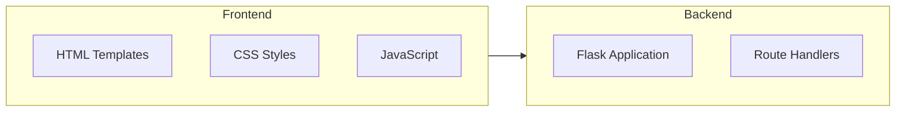

## 1. Architecture Design



## 2. Technology Description
- 前端: HTML5 + CSS3 + JavaScript
- 后端: Flask@3.0 (Python Web 框架)
- 模板引擎: Jinja2
- 初始化工具: 手动创建项目结构

## 3. Route Definitions
| Route | Purpose |
|-------|---------|
| / | 主页 |
| /about | 关于页面 |
| /demo | 交互演示页面 |
| /api/greet | API 端点，处理演示数据 |

## 4. Project Structure
```
/workspace/
├── app.py                 # Flask 应用主文件
├── requirements.txt       # Python 依赖
├── static/                # 静态资源
│   ├── css/
│   │   └── style.css
│   └── js/
│       └── main.js
└── templates/             # HTML 模板
    ├── base.html          # 基础模板
    ├── index.html         # 主页
    ├── about.html         # 关于页
    └── demo.html          # 演示页
```
