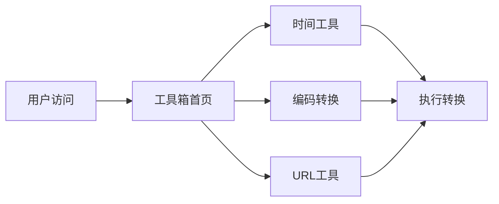

## 1. 产品概述
一个实用的在线工具箱Web应用，提供开发者常用的工具集合，帮助用户快速完成日常开发任务。
- 包含时间工具、编码转换、URL工具等实用功能
- 目标用户：开发者、运维人员、学生等需要频繁使用工具的人群

## 2. 核心功能

### 2.1 工具模块

#### 2.1.1 时间工具
- **时间戳转换**: 支持Unix时间戳与可读日期时间的相互转换
- **当前时间**: 显示当前时间戳和格式化时间
- **时区转换**: 支持不同时区的时间转换

#### 2.1.2 编码转换工具
- **Base64编码/解码**: 字符串与Base64格式的相互转换
- **URL编码/解码**: URL特殊字符的编码和解码
- **HTML实体编码/解码**: HTML特殊字符的处理

#### 2.1.3 URL工具
- **URL编码/解码**: 对URL进行全面编码解码处理
- **URL参数解析**: 解析URL中的查询参数
- **URL构建器**: 通过参数构建完整的URL

### 2.2 页面详情
| 页面名称 | 模块名称 | 功能描述 |
|---------|---------|---------|
| 工具箱首页 | 工具卡片展示 | 展示所有可用工具的卡片列表 |
| 时间工具 | 时间戳转换 | Unix时间戳与日期时间互转 |
| 时间工具 | 时区转换 | 不同时区的时间转换 |
| 编码转换 | Base64工具 | Base64编码解码 |
| 编码转换 | URL编码工具 | URL编码解码 |
| 编码转换 | HTML实体工具 | HTML实体编码解码 |
| URL工具 | URL解析器 | URL参数解析和构建 |

## 3. 核心流程
用户访问首页 -> 选择需要的工具 -> 进入工具页面进行操作 -> 获得结果



## 4. 用户界面设计

### 4.1 设计风格
- 主色调：深蓝色 (#1e3a8a) 和浅蓝色 (#3b82f6)
- 工具卡片：带图标和描述，悬停效果明显
- 按钮风格：圆角设计，带有悬停效果
- 字体：使用系统默认字体，简洁清晰
- 布局风格：卡片式布局，响应式设计
- 图标：使用emoji图标，简单直观

### 4.2 页面设计概览
| 页面名称 | 模块名称 | UI元素 |
|---------|---------|--------|
| 工具箱首页 | 工具导航 | 网格布局的工具卡片，每个卡片包含图标、标题、描述 |
| 时间工具 | 时间戳转换 | 输入框、转换按钮、结果显示区 |
| 时间工具 | 时区选择 | 下拉选择器、转换结果 |
| 编码转换 | 编码区域 | 文本输入、编码类型选择、转换按钮、输出区域 |
| URL工具 | URL输入 | URL输入框、解析按钮、参数列表展示 |

### 4.3 响应式设计
桌面优先，移动端适配良好。工具卡片在移动端改为单列或双列显示。

## 5. API接口设计

### 5.1 时间工具API
```
POST /api/timestamp
Request: { "timestamp": 1234567890 }
Response: { "datetime": "2009-02-13 23:31:30", "timestamp": 1234567890 }

POST /api/datetime
Request: { "datetime": "2024-01-01 12:00:00" }
Response: { "timestamp": 1704100800 }
```

### 5.2 编码转换API
```
POST /api/encode
Request: { "text": "Hello", "type": "base64" }
Response: { "result": "SGVsbG8=" }

POST /api/decode
Request: { "text": "SGVsbG8=", "type": "base64" }
Response: { "result": "Hello" }
```

### 5.3 URL工具API
```
POST /api/url/encode
Request: { "url": "https://example.com?name=test&value=你好" }
Response: { "encoded": "https://example.com?name=test&value=%E4%BD%A0%E5%A5%BD" }

POST /api/url/parse
Request: { "url": "https://example.com?a=1&b=2" }
Response: { "params": { "a": "1", "b": "2" } }
```
