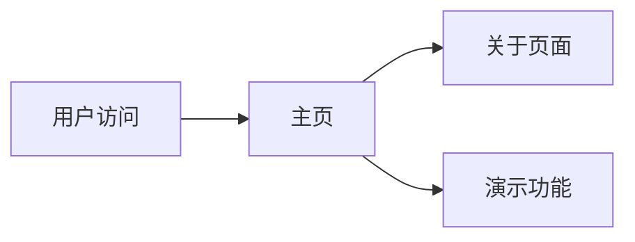

## 1. Product Overview
一个简单但功能完整的 Flask Web 应用示例，用于展示 Python Web 开发的基础架构和最佳实践。
- 包含主页、关于页面和简单的交互式功能
- 目标用户：学习 Python Web 开发的开发者或需要快速搭建演示应用的团队

## 2. Core Features

### 2.1 Feature Module
1. **Home page**: 英雄区域、导航栏、功能展示卡片
2. **About page**: 项目介绍、技术栈说明
3. **Interactive Demo**: 简单的表单提交和数据展示功能

### 2.3 Page Details
| Page Name | Module Name | Feature description |
|-----------|-------------|---------------------|
| Home page | Hero section | 欢迎语、项目描述、快速启动按钮 |
| Home page | Feature cards | 展示三个核心功能 |
| About page | Tech stack | 列出使用的技术和库 |
| Interactive Demo | Form submission | 用户输入数据并展示响应 |

## 3. Core Process
用户访问主页 -> 浏览功能 -> 点击导航到关于页面 -> 或进入演示页面进行交互

## 4. User Interface Design
### 4.1 Design Style
- 主色调：深蓝色 (#1e3a8a) 和浅蓝色 (#3b82f6)
- 按钮风格：圆角设计，带有悬停效果
- 字体：使用系统默认字体，简洁清晰
- 布局风格：卡片式布局，响应式设计
- 图标：使用简单的 SVG 图标或 emoji

### 4.2 Page Design Overview
| Page Name | Module Name | UI Elements |
|-----------|-------------|-------------|
| Home page | Hero section | 居中布局，大标题，渐变背景 |
| Home page | Feature cards | 三列网格，卡片式布局，悬停效果 |
| About page | Content | 两列布局，左侧文字，右侧技术栈列表 |
| Interactive Demo | Form | 简洁表单，实时反馈 |

### 4.3 Responsiveness
桌面优先，支持移动端适配，触摸交互优化
